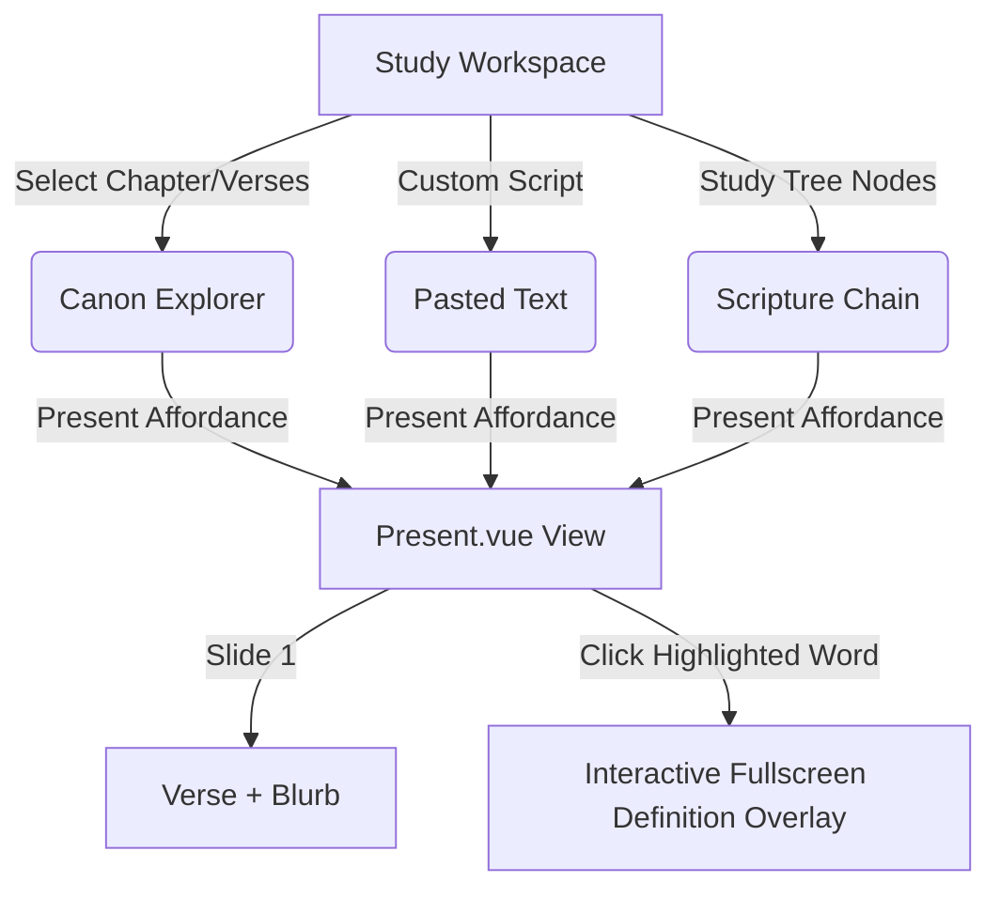
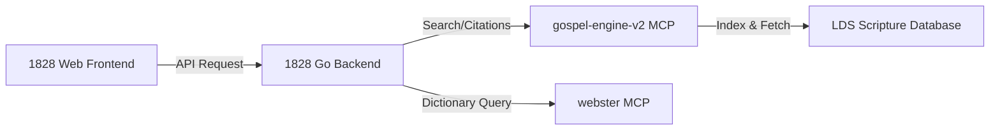

# UX and Presentation Enhancements — Study and Articulation

## I. Executive Summary & Vision

The core mission of **1828 Illuminated** is to use the 1828 Webster dictionary as a lens to study the scriptures, uncovering Restoration-era language context, etymologies, and semantic connections. 

However, scriptural study is not just an individual consumption loop (reading/exploring); it is a relational and pedagogical loop (understanding/sharing). There are two distinct modes of use that the application must support seamlessly:
1. **Exploration Mode (Study)**: The researcher follows word-to-verse and verse-to-word chains, branching off into tangents, tracking etymologies, and building a branching study tree.
2. **Articulation Mode (Presenting)**: The teacher presents these chains, word definitions, and scriptural insights to a classroom, study group, or family.

This proposal outlines the next evolution of the UX/UI of both modes, addressing current pain points in navigation, extending the presentation mode to arbitrary inputs, introducing inline path visualization, and detailing cloud account integration and MCP extension paths.

---

## II. Shipped / In-Flight UX Quick-Fixes

Per the project stewardship covenant, we have identified and immediately resolved several active friction points in the codebase:

### II.1. Reactive Count for E-Tier Words
* **Problem**: The E-Tier search filter button (representing all 98,828 headwords outside of the curated list) was stuck at `0` words. 
* **Cause**: In [useWordData.ts](file:///c:/Users/cpuch/Documents/code/stuffleberry/scripture-study/projects/1828-illuminated/frontend/src/composables/useWordData.ts), the `tierCounts` record was a plain JavaScript object. When the lazy-loaded headwords list returned from the backend, Vue did not track the update to `tierCounts.E`.
* **Fix**: Wrapped `tierCounts` in a Vue `reactive()` wrapper. Now, as soon as the full headword corpus is loaded, the count reactive state triggers a re-render, displaying the correct count (e.g. `98,828` minus curated maps).

### II.2. Direct Routing Toggles on Titles
* **Problem**: When a user was already viewing a word definition page (`WordDetail.vue`), clicking the title (the word itself) did nothing. Conversely, when in scripture mode (`WordStudy.vue`), there was no obvious way to click the word to view its definition card.
* **Fix**: 
  - Updated [WordCard.vue](file:///c:/Users/cpuch/Documents/code/stuffleberry/scripture-study/projects/1828-illuminated/frontend/src/components/WordCard.vue) to check the current route. If the user is on the definition page `/word/:word`, the title is a RouterLink pointing to `/word-study/:word` (scripture occurrences), with a descriptive tooltip. If viewed anywhere else, it routes to `/word/:word`.
  - Updated [WordStudy.vue](file:///c:/Users/cpuch/Documents/code/stuffleberry/scripture-study/projects/1828-illuminated/frontend/src/views/WordStudy.vue) to turn the main page header into a clickable link leading back to the word's 1828 definition `/word/:word`.

### II.3. Inline Definition Previews in Scripture Mode
* **Problem**: While browsing scripture occurrences in `WordStudy.vue` (scripture mode), clicking highlighted words routed the user to a new `WordStudy` page. There was no way to preview a word's definition without losing their place.
* **Fix**:
  - Modified [WordStudy.vue](file:///c:/Users/cpuch/Documents/code/stuffleberry/scripture-study/projects/1828-illuminated/frontend/src/views/WordStudy.vue) to widen the layout container (from `max-w-3xl` to `max-w-6xl` grid layout, matching `VerseExplorer.vue`) and placed the `WordCard` preview aside panel on the right.
  - Modified [HighlightedText.vue](file:///c:/Users/cpuch/Documents/code/stuffleberry/scripture-study/projects/1828-illuminated/frontend/src/components/HighlightedText.vue) to support a **Shift+Click modifier shortcut** (also accepts Ctrl/Alt/Meta keys).
    - In **Scripture Mode**: standard click navigates to occurrences; `Shift+Click` opens the definition card in-place in the right sidebar.
    - In **Definition Mode**: standard click opens the definition in-place; `Shift+Click` navigates to scripture occurrences.
    - Updated hover tooltips to advertise this shortcut to the user.

---

## III. Advanced Presentation Mode

Currently, `Present.vue` is a fullscreen tablet-friendly slide viewer that only works for the pre-seeded `demo-verses.json` array. This must be extended to support any study path.



### III.1. Presenting Arbitrary Scriptures & Pasted Text
We propose supporting dynamic content routes in `Present.vue`:
1. **Canon Mode**: `?mode=canon&ref=1-ne/3:7` (or chapter `?mode=canon&b=1-ne&c=3`). When loaded, navigation buttons (`prev` / `next`) scroll through the verses of the loaded chapter or book instead of demo-verses.
2. **Pasted/Custom Mode**: `?mode=paste&text=EncodedString`. Useful for presenting a specific customized verse block.

We will add a prominent **"📖 Present"** button in both the Browse Canon and Paste containers of `VerseExplorer.vue`.

### III.2. Presenting Scripture Chains (The Study Tree Deck)
A study tree is essentially a prepared scriptural chain. We should support presenting a specific branch of the Study Tree:
* **Route**: `/present?mode=tree&root=nodeId` or `/present?mode=active-path`
* **Slides**: Each node in the tree path (verse, chapter, etymology word, note) becomes a slide.
* **Flow**:
  - Slide 1: Word detail card (e.g. *Obtain*)
  - Slide 2: Scripture verse containing the word (e.g. *1 Nephi 3:7*, with *Obtain* highlighted)
  - Slide 3: LLM Modern English rendering of that verse
  - Slide 4: Next word in the study path (e.g. *Commandment*)

### III.3. Presentation UI & Hardware Controls
* **Double-Display / Cast Mode**: An option to open a "Presenter View" window (showing search tools, etymology notes, and slide navigator) while the main browser tab remains clean and fullscreen on a projector.
* **Pencil / Drawing Overlay**: A canvas overlay allowing the presenter to draw/underline words directly on the screen using a stylus or mouse.
* **Layout Adjustment**: A text scaling slider (`- A +`) for easy adjustment based on screen size, and visual themes (lcars-dark, LCARS-orange, paper-warm, sepia).

---

## IV. Inline Study Breadcrumbs

While the side-drawer `StudyTreePanel.vue` is useful, it hides the path behind a toggle and takes up significant screen real estate. To make the "branching time-travel" nature of the tool clear, we propose adding a lightweight, inline breadcrumb tracker at the top of main views (`WordDetail.vue`, `WordStudy.vue`, `VerseExplorer.vue`).

```
Study path:  obtain ➔ Mosiah 4:27 ➔ strength ➔ [D&C 88:67] ▾ (2 sibling branches)
```

### IV.1. Layout & Interactivity
* **Path Display**: Shows the chain from the root of the active branch down to the current node.
* **Jump Navigation**: Hovering over any breadcrumb segment shows its details (e.g. hovering over `Mosiah 4:27` shows the verse text). Clicking it jumps the application state and router back to that node.
* **Branching Selector**: If a node has multiple children (the user branched multiple times from it), a small arrow indicator `▾` is rendered. Clicking it opens a dropdown listing the alternative paths (siblings). Selecting one pisses the router to that branch.

```
       obtain
         └── Mosiah 4:27
               └── strength ➔ D&C 88:67 (Active)
               └── run      ➔ Mosiah 4:27 (Branch B)
```

---

## V. Account Integration & Cloud Saving

To allow users to save their study trees, share scripture chains, and sync their study progress between devices (e.g., studying on a phone in the morning, presenting on a tablet at night), we need a lightweight authentication and account structure.

### V.1. Backend Go Schema Extension
We will introduce `users`, `saved_trees`, and `presentation_decks` tables in Postgres:
```sql
CREATE TABLE users (
    id UUID PRIMARY KEY DEFAULT gen_random_uuid(),
    email VARCHAR(255) UNIQUE NOT NULL,
    google_id VARCHAR(255),
    created_at TIMESTAMP WITH TIME ZONE DEFAULT NOW()
);

CREATE TABLE saved_trees (
    id UUID PRIMARY KEY DEFAULT gen_random_uuid(),
    user_id UUID REFERENCES users(id) ON DELETE CASCADE,
    title VARCHAR(255) NOT NULL,
    tree_data JSONB NOT NULL, -- full StudyNode array
    updated_at TIMESTAMP WITH TIME ZONE DEFAULT NOW()
);
```

### V.2. Authentication Flow
* **BYOK and Accounts**: Authentication remains entirely decoupled from LLM access. The LLM BYOK key resides in local storage/session storage, while saved trees sync to the user account.
* **Sign-In Options**: Lightweight OAuth 2.0 (Google Sign-In) to leverage `ibeco.me` session sharing.
* **Anonymous Guest Mode**: Users can still study locally without an account. Hitting "Save permanently" triggers a prompt to sign in, which copies the localStorage tree to the cloud.

---

## VI. MCP & gospel-engine-v2 Integration

The `scripture-study` workspace contains powerful MCP servers (`byu-citations`, `gospel-engine-v2`, `webster`). We can leverage these inside the `1828-illuminated` web app directly.



### VI.1. Automated Citation Mapping (`byu-citations`)
* When looking up a word or chapter, the backend queries the `byu-citations` server to find other General Conference talks, historical texts (Joseph Smith Papers), or BYU studies that cite the active passage.
* These citations are rendered on the right side of the `VerseExplorer` or `WordStudy` view under a "Conference Citations" header.

### VI.2. Cross-Search Integration (`gospel-engine-v2`)
* The search input on `WordSearch.vue` and `VerseExplorer.vue` can have a fallback "Deep Search" mode.
* If a search yields zero database hits, the Go backend proxies the query to `gospel_search` in the gospel-engine. This crawls and pulls relevant LDS scriptures or publications on-the-fly, suggesting candidate words that match the Webster semantic context.

---

## VII. Decisions for Ratification

To prepare for implementation, we present the following decision matrix for stewardship council review:

| ID | Decision | Options | Recommended | Rationale |
|---|---|---|---|---|
| **D-UX-1** | Presentation input flexibility | **A**: Only Canon/Demo<br>**B**: Canon + Paste + Chains | **B (All Inputs)** | Essential for teachers to present custom research slides. |
| **D-UX-2** | Sibling Branch UI | **A**: Dropdown list in breadcrumb<br>**B**: Sidebar panel only | **A (Dropdown)** | Keeps the branching "time-travel" visible without layout clutter. |
| **D-UX-3** | Auth Provider | **A**: Email/Password<br>**B**: Google OAuth Only<br>**C**: Email + Google | **B (Google OAuth)** | Simplest security surface, matches `ibeco.me` infrastructure. |
| **D-UX-4** | MCP Backend Tunneling | **A**: Direct client MCP call<br>**B**: Go API Proxy to local MCP | **B (API Proxy)** | Frontend remains a clean static SPA, backend handles tool orchestration. |

---

## VIII. Implementation Roadmap

1. **Phase 1 (Navigation Toggles & Presentation Mode Extension)**:
   - Wire Browse Canon and Paste modes to the `/present` view using query parameters.
   - Install "Present" buttons on all Verse Explorer states.
2. **Phase 2 (Inline Breadcrumbs)**:
   - Build `<StudyBreadcrumbs />` component fetching active path from `useStudyTree`.
   - Implement dropdown selector for sibling branches.
3. **Phase 3 (Google Auth & Postgres Saved Trees)**:
   - Extend Go backend with user sessions and Postgres CRUD for study trees.
   - Add save/load manager in `StudyTreePanel.vue`.
4. **Phase 4 (gospel-engine & BYU Citation Ingest)**:
   - Connect backend search / detail controllers to local MCP tools to enrich definition cards with Conference citations and deep search fallbacks.
